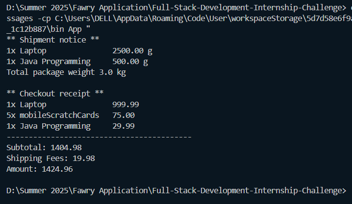

# 🛒 Full Stack Development Internship Challenge

This is a **Java-based shopping cart system** that models real-world purchasing behavior. It demonstrates object-oriented programming, exception handling, and encapsulation through a hierarchy of products, customers, and checkout logic.

---

## 📦 Project Description

The project simulates a minimal e-commerce shopping system that includes:

- Different product types:
  - 📕 `ShippableProduct`
  - 🥛 `ExpirableProduct`
  - 🧀 `ExpirableShippableProduct`
- A `Customer` class with wallet balance and contact info
- A `Cart` class to add items and compute totals
- Checkout functionality with validations for:
  - Product availability
  - Expiry dates
  - Customer balance

---

## 🏃‍♂️ How to Run

### ✅ Prerequisites

- Java 8 or higher
- Terminal or any IDE like IntelliJ / Eclipse

### 📌 Steps

1. Clone the repository:
   ```bash
   git clone https://github.com/saeed174/Full-Stack-Development-Internship-Challenge.git
   cd Full-Stack-Development-Internship-Challenge

## Output Screen

